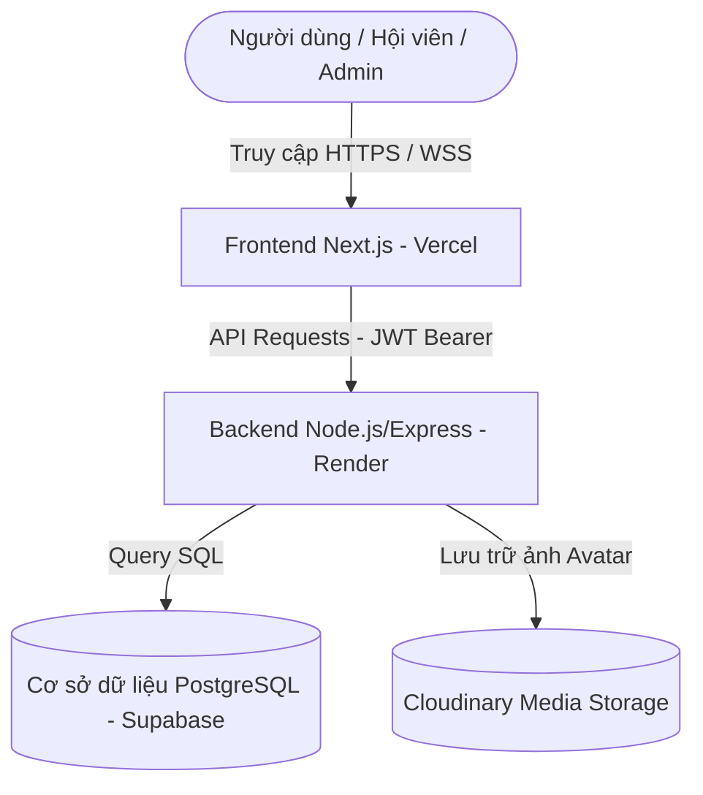

# SMASH TEAM - HỆ THỐNG QUẢN LÝ CÂU LẠC BỘ CẦU LÔNG (BADMINTON CLUB PLATFORM)

Chào mừng bạn đến với **SMASH TEAM Badminton Platform** - hệ thống quản lý câu lạc bộ cầu lông hiện đại tích hợp tính năng **Gamification** (Thẻ người chơi, xếp hạng điểm ELO, SmashPass, Kho Đồ) và cổng thông tin thành viên (Player Portal) trực quan, được thiết kế chuyên biệt cho Ban chủ nhiệm và Hội viên.

---

## 1. KIẾN TRÚC HỆ THỐNG (SYSTEM ARCHITECTURE)

Hệ thống được phát triển theo mô hình **Client-Server** tách biệt hoàn toàn (Decoupled Architecture), tối ưu hóa tải trọng và dễ dàng triển khai đa nền tảng.



### 1.1. Công nghệ Frontend (Next.js App Router)
* **Framework chính:** Next.js (React 19) chạy trên kiến trúc App Router tối tân hỗ trợ Server-Side Rendering (SSR) và Client-side Navigation (SPA).
* **Styling (CSS):** Tailwind CSS v4 tối ưu hóa hiệu năng biên dịch và quản lý hệ màu tùy biến (`bg-smash-dark`, neon tím/bạc).
* **Hiệu ứng & Animation:** Framer Motion (cho các chuyển động mượt mà, transition tab) và Canvas Confetti (hiệu ứng ăn mừng khi check-in thành công).
* **Mã QR Code:** Tích hợp `qrcode.react` để tạo mã QR Code check-in sân sắc nét.
* **Nhạc nền BGM:** Tích hợp bộ phát nhạc nền loop chất lượng cao Synthwave/EDM tự động phát khi phát hiện tương tác đầu tiên của người dùng.

### 1.2. Công nghệ Backend & Database
* **Runtime Environment:** Node.js v18+ kết hợp Express framework.
* **Cơ sở dữ liệu:** PostgreSQL lưu trữ dữ liệu quan hệ, được lưu trữ và tối ưu hóa kết nối trên nền tảng Supabase Cloud.
* **Giao dịch Cơ sở dữ liệu (Database Transactions):** Bọc các logic nhận quà, mua Premium Pass trong khối Transaction để chống lỗi click trùng (Race Condition Prevention).
* **Bảo mật & Mã hóa:** Xác thực phiên làm việc bằng JSON Web Tokens (JWT) bảo vệ các API quản trị và API trang cá nhân. Mật khẩu được mã hóa an toàn bằng bcrypt trước khi lưu vào DB.
* **Lưu trữ tệp tin:** Tích hợp bộ thư viện Multer + Cloudinary SDK để tải ảnh đại diện lên bộ nhớ đám mây Cloudinary của câu lạc bộ, tự động tối ưu hóa dung lượng ảnh đại diện.

---

## 2. CÁC TÍNH NĂNG CHÍNH (KEY FEATURES)

### 2.1. Cổng Thông Tin Thành Viên (Player Portal `/profile`)
Trang cá nhân của hội viên được thiết kế mang đậm phong cách Game chuyên nghiệp:
* **Thẻ Người Chơi ELO (Player Card):** Hiển thị dọc bóng bẩy với viền neon phát sáng thay đổi màu sắc động dựa theo cấp Rank ELO hiện tại.
* **Bảng Thông Số Kỹ Thuật (Stats Board):** Thống kê số trận đấu, tỷ lệ thắng, chuỗi thắng/thua liên tục, và hiển thị các huy hiệu (Badges) kỹ năng mềm đóng góp cho CLB (Chụp ảnh, Quay dựng, Thiết kế, Hỗ trợ giải).
* **Đăng ký Lịch tập (RSVP):** Hiển thị lịch sinh hoạt sắp tới của CLB. Cho phép hội viên chọn RSVP (Tham gia / Vắng mặt) trực tiếp. Hành động này chỉ ghi nhận lịch trình đi tập để BTC chuẩn bị (không cộng điểm khống để tránh trục lợi).

### 2.2. Hệ Thống Gamification SmashPass & Kho Đồ
* **Quests Engine (Nhiệm vụ):**
  * Hỗ trợ nhiệm vụ Hàng ngày, Hàng tuần, Hàng tháng và Mùa giải.
  * Tích hợp cơ chế **Lazy-Reset**: Khi thành viên mở tab Nhiệm vụ, Backend tự động đối chiếu thời gian `updated_at` để reset tiến trình của chu kỳ mới mà không cần cron job ngầm.
  * **Chống Spam quà:** Bọc logic nhận quà trong DB Transaction với câu lệnh `FOR UPDATE` khóa dòng dữ liệu nguyên tử.
* **SmashPass (Battle Pass):**
  * Hệ thống 10 cấp độ thưởng.
  * Thành viên dùng Xu kiếm được để mở khóa **Premium Pass** nâng cấp, nhận quà độc quyền (Khung viền Neon Bạc, Neon Tím, Danh hiệu lấp lánh).
* **Kho Đồ (Inventory):** Nơi lưu trữ vật phẩm (Khung viền, danh hiệu) nhận được. Người dùng có thể click Trang bị/Tháo trang bị realtime, tự động đồng bộ hiển thị lên thẻ người chơi.

### 2.3. Hệ Thống Điểm Danh QR & Quản lý Buổi Tập (Admin)
* **Cổng Điểm Danh Thành Viên (`/check-in`):** Thành viên quét mã QR tại sân sẽ được chuyển đến trang điểm danh.
  * *Chống gian lận (Active Time Window Check):* Chỉ cho phép check-in thành công trong khung giờ: Giờ bắt đầu buổi tập - 30 phút <= giờ hiện tại <= giờ bắt đầu buổi tập + 120 phút.
  * *Quà tặng chuyên cần:* Điểm danh thành công thưởng ngay **+25 XP và +10 Smash Coins**, kích hoạt pháo hoa lấp lánh và tự động đẩy tiến trình các nhiệm vụ liên quan.
* **Quản Lý Buổi Tập (`/admin/sessions`):** Admin thiết lập buổi tập mới, tự động sinh mã QR check-in sắc nét, hỗ trợ tải file ảnh QR PNG về máy để in ấn dán tại sân. Theo dõi danh sách check-in realtime của thành viên.
* **Cấu Hình Nhiệm Vụ (`/admin/quests`):** Admin tạo nhiệm vụ mới, thiết lập thông số (chu kỳ, hành động yêu cầu, phần thưởng) và toggle bật/tắt hoạt động nhiệm vụ.

### 2.4. Đánh Giá Tuyển Chọn Casting & Chào Mừng Thành Viên Mới
* **Duyệt Ứng Viên Casting:** Khi duyệt ứng viên, Admin mở Modal **"Xác nhận & Đánh giá Tuyển chọn"** (bố cục mờ ảo tím neon):
  * *Chuẩn hóa thông tin:* Sửa trực tiếp họ tên, số điện thoại, trường lớp của ứng viên nếu bị sai sót chính tả.
  * *Kiểm tra trùng SĐT:* Chặn trùng số điện thoại với bất cứ ai trong CLB (trả về lỗi 400).
  * *Phân loại trình độ 1-5 sao:* Đánh giá thực lực của ứng viên để tự động khởi tạo điểm ELO phù hợp (Mới chơi -> 900 ELO, Trung bình -> 1000 ELO, Khá/Giỏi -> 1150 ELO).
  * *Ghi chú tuyển chọn:* Nhập nhận xét chuyên môn và lưu trữ vào trường `casting_notes`.
* **Welcome Message Copier:** Sau khi duyệt thành công, hiển thị Popup chúc mừng với mẫu tin nhắn soạn sẵn (tên, số sao, điểm ELO khởi điểm, link kích hoạt tài khoản) cùng nút **"Copy tin nhắn"** gửi Zalo ứng viên cực nhanh.
* **Quản Lý User vĩnh viễn:** Admin có thể xóa vĩnh viễn bất kỳ tài khoản nào khỏi hệ thống (có chặn tự xóa chính mình) tại mục Thao tác nhanh.

### 2.5. Trang Chủ & Bảng Xếp Hạng Công Khai (`/`)
* **Leaderboard:** Xếp hạng điểm ELO công khai của các thành viên. Hỗ trợ chuyển đổi tab xem điểm ELO Đơn (Singles) hoặc điểm ELO Đôi (Doubles).
* **Bản tin Media Feed:** Hiển thị các hình ảnh sinh hoạt, video highlight từ YouTube của CLB.

---

## 3. SƠ ĐỒ CƠ SỞ DỮ LIỆU (DATABASE SCHEMA)

Cấu trúc cơ sở dữ liệu PostgreSQL gồm các bảng chính:

### Bảng `users` (Lưu trữ người dùng, ứng viên, thành viên, admin)
* `id` (UUID, Khóa chính)
* `full_name` (VARCHAR)
* `phone_zalo` (VARCHAR) - *Chặn trùng lặp SĐT khi Đăng ký và khi BTC Duyệt.*
* `gender` (VARCHAR) - Giới tính (Nam, Nữ, Khác)
* `academic_info` (VARCHAR)
* `badminton_level` (VARCHAR) - Trình độ ('Mới chơi', 'Trung bình', 'Khá/Giỏi')
* `role` (VARCHAR) - Vai trò ('candidate', 'member', 'admin')
* `status` (VARCHAR) - Trạng thái hoạt động ('active', 'inactive', 'left')
* `is_blocked` (BOOLEAN) - Khóa tài khoản
* `level` / `xp` / `smash_coins` (INTEGER) - Gamification metrics
* `streak` / `streak_shields` (INTEGER) - Chỉ số duy trì streak điểm danh
* `active_frame` / `active_title` (VARCHAR) - Khung viền và danh hiệu đang trang bị
* `casting_notes` (TEXT) - Nhận xét chuyên môn của BTC khi duyệt casting
* `elo_singles` / `elo_doubles` (INTEGER) - Điểm ELO đơn/đôi (Mới chơi: 900, Trung bình: 1000, Khá/Giỏi: 1150)
* `matches_singles` / `matches_doubles` (INTEGER)
* `win_singles` / `win_doubles` (INTEGER)
* `loss_singles` / `loss_doubles` (INTEGER)
* `password_hash` (VARCHAR)
* `joined_at` / `created_at` (TIMESTAMP)

### Bảng `quests` (Cấu hình nhiệm vụ trong hệ thống)
* `id` (SERIAL, Khóa chính)
* `title` (VARCHAR) - Tên nhiệm vụ
* `quest_type` (VARCHAR) - Chu kỳ ('daily', 'weekly', 'monthly', 'seasonal')
* `action_type` (VARCHAR) - Hành động ('check_in', 'play_matches', 'win_matches', 'custom')
* `target_count` (INTEGER) - Số lần cần làm
* `xp_reward` / `coin_reward` (INTEGER) - Phần thưởng
* `is_active` (BOOLEAN) - Trạng thái hoạt động

### Bảng `user_quests` (Lưu tiến trình nhiệm vụ của thành viên)
* `user_id` (UUID, Khóa ngoại)
* `quest_id` (INTEGER, Khóa ngoại)
* `current_count` (INTEGER) - Tiến độ hiện tại
* `is_completed` / `is_claimed` (BOOLEAN) - Đã hoàn thành / Đã nhận quà
* `updated_at` (TIMESTAMP)

### Bảng `smash_pass_rewards` (Cấu hình mốc Battle Pass)
* `id` (SERIAL, Khóa chính)
* `season_id` (INTEGER)
* `level_required` (INTEGER) - Cấp độ yêu cầu để nhận (1-10)
* `reward_type` (VARCHAR) - Loại quà ('title', 'coins', 'avatar_frame', 'streak_shield')
* `reward_name` (VARCHAR) - Tên hiển thị quà
* `reward_value` (VARCHAR) - Giá trị lưu trữ/mã của quà
* `is_premium` (BOOLEAN) - Quà Premium hay miễn phí

### Bảng `user_inventory` (Túi đồ vật phẩm thành viên sở hữu)
* `id` (SERIAL, Khóa chính)
* `user_id` (UUID, Khóa ngoại)
* `item_type` (VARCHAR) - Loại vật phẩm ('avatar_frame', 'title')
* `item_name` (VARCHAR) - Tên vật phẩm
* `item_value` (VARCHAR) - Giá trị/Mã của vật phẩm
* `is_equipped` (BOOLEAN) - Trạng thái trang bị
* `acquired_at` (TIMESTAMP)

### Bảng `sessions` (Các buổi tập luyện / Casting)
* `id` (UUID, Khóa chính)
* `title` (VARCHAR)
* `date_time` (TIMESTAMP)
* `location` (VARCHAR)

### Bảng `attendances` (Điểm danh RSVP & Check-in QR)
* `id` (UUID, Khóa chính)
* `session_id` (UUID, Khóa ngoại)
* `user_id` (UUID, Khóa ngoại)
* `status` (VARCHAR) - Trạng thái RSVP ('going', 'absent')
* `checked_in_at` (TIMESTAMP) - Thời điểm quét mã QR check-in thực tế tại sân
* *Khóa Unique trên cặp (`session_id`, `user_id`)* để đảm bảo không trùng lặp RSVP.

---

## 4. HƯỚNG DẪN CÀI ĐẶT CỤC BỘ (LOCAL SETUP)

### Bước 1: Sao chép mã nguồn và thiết lập môi trường
1. Clone dự án về máy.
2. Tại thư mục `/backend`, tạo tệp `.env` cấu hình các biến môi trường dựa theo tệp `template.env` mẫu:
   ```env
   DATABASE_URL=postgresql://<user>:<password>@<host>:<port>/<dbname>
   JWT_SECRET=ma_bao_mat_jwt_cua_ban
   PORT=5000
   CLOUDINARY_CLOUD_NAME=ten_cloud_cua_ban
   CLOUDINARY_API_KEY=key_cua_ban
   CLOUDINARY_API_SECRET=secret_cua_ban
   CLUB_VERIFY_PIN=123456
   ```

### Bước 2: Chạy dự án cực nhanh bằng tập lệnh tự động
Dự án đã tích hợp sẵn tệp kịch bản `start-dev.bat` ở thư mục gốc giúp cài đặt toàn bộ dependencies và khởi chạy cả hai máy chủ cục bộ song song:
1. Nhấp đúp chuột vào tệp [start-dev.bat](file:///f:/WebCLB/smashteam-badminton/start-dev.bat).
2. Tệp tin sẽ tự động mở 2 cửa sổ terminal:
   * **Cổng 3000:** Giao diện Frontend (`http://localhost:3000`)
   * **Cổng 5000:** API Backend (`http://localhost:5000`)

Bạn có thể thay đổi cổng hoặc cấu hình môi trường tùy ý trong tệp tin `.env` tương ứng!
